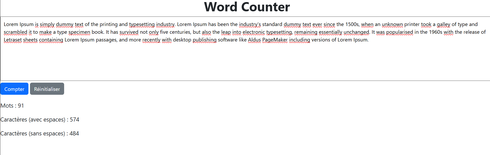

# 📝 Word Counter

A simple web application that counts words, characters, and more in a given text.

---

## 📋 General Description

**Word Counter** is a lightweight and fast tool that allows the user to:
- ✏️ Freely enter text
- 🔍 Analyze the number of **words**, **characters (with or without spaces)**
- 🧮 (Optional) Count **sentences** or **paragraphs**
- ♻️ Easily reset the text input field

---

## 🚀 Key Features

- ✅ **Text input area** (`<textarea>`)
- ✅ Accurate **word counter**
- ✅ **Character counter** (with and without spaces)
- ✅ **"Count" button** to launch the analysis
- ✅ **"Reset" button** to clear everything
- 📱 Responsive design: works on both mobile and desktop

---

## 🛠️ Technologies Used

- 🌐 **HTML5** for structure
- 🎨 **CSS3/Bootstrap5** for styling
- ⚙️ **JavaScript / jQuery** for logic

---

## 📸 Screenshot

Add a screenshot here if you like:




## 🔗 Live Demo

👉 [Click here to try Word Counter](https://abdelwaheb-net.github.io/Word-Counter/)


## 📁 Project Structure

```

Word-Counter/
├── JQuery
│   └── jquery-3.7.1.min.js
├── index.html
├── screenshot.png
├── script.js
└── README.md

```
## 📄 License
This project is open-source under the MIT license.
